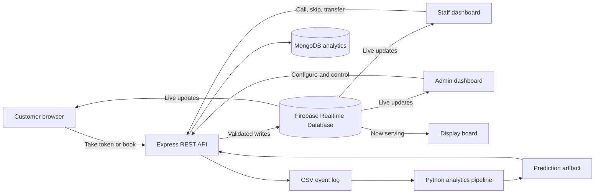

# QueueLess: Complete Project Guide

## 1. Project summary

QueueLess is a full-stack digital queue and token management system. It replaces paper tokens and physical waiting lines with a live browser experience.

A customer can join a queue from a phone or computer, receive a token, see their position, estimate the wait, and receive an alert when their turn is close. Staff use a separate dashboard to call and manage tokens. Administrators manage queues, staff, appointments, reports, settings, and access permissions.

QueueLess is designed for places such as:

- Hospitals and clinics
- Banks and finance offices
- Government and general service offices
- Restaurants and dining businesses
- Any organization with multiple counters or waiting lines

Customers do not need to install an application or create an account. A web browser is enough.

---

## 2. The problem it solves

Traditional queues create problems for everyone involved.

### Customer problems

- The customer does not know the real waiting time.
- The customer must remain near the counter to avoid missing a turn.
- Paper tokens can be lost, damaged, repeated, or misunderstood.
- Priority customers may not receive consistent handling.
- Appointment customers and walk-in customers may be managed separately.

### Staff problems

- Staff manually decide who should be served next.
- Different counters may have different information.
- Transfers between departments are difficult to track.
- Notes and no-show decisions may not be recorded.
- Staff cannot easily see whether another service has urgent customers.

### Management problems

- Managers cannot easily identify busy hours.
- Staffing decisions are often based on assumptions.
- Drop-offs, service times, and queue performance are difficult to measure.
- There may be no reliable history of what happened during the day.

QueueLess makes the queue visible, coordinated, and measurable.

---

## 3. Main users

### Customers

Customers use the public website. They do not need an account.

They can:

- View available services.
- Preview the current queue length and estimated wait.
- Take a normal or priority token.
- Select a group size for a family or group visit.
- Track position and estimated waiting time live.
- Receive browser notifications when they are almost next.
- Book an appointment.
- Re-queue an eligible expired token.
- Recover a token using its ID.
- View token history stored on the current device.
- Receive a token tracking link by email when email is enabled.
- Submit a rating and comment after being served.

### Staff

Staff log in with a username and password or use a PIN on a shared kiosk.

They can:

- View the queue for their assigned service.
- Call the next customer.
- Skip or mark a customer as a no-show.
- Add a note to a token.
- Transfer a token to another service.
- See priority warnings and announcements.
- Edit their profile and password.
- Show online or offline presence to administrators.

### Managers and administrators

Managers and administrators operate the organization.

They can:

- View every active queue and service counter.
- Call, skip, transfer, pause, resume, or reset queues.
- Create and configure custom queues.
- Manage staff assignments.
- Manage appointments and feedback.
- Publish announcements.
- Review analytics and predictions.
- Export data and print reports.
- Use the operational AI assistant.
- Manage messages, notifications, shared files, and secure links.
- Review sensitive activity in the audit log.

### Display-board viewers

The `/display` page is designed for a television or shared screen. It shows current tokens, priority calls, announcements, and a live clock.

---

## 4. How the complete system works



### Step-by-step customer journey

1. The frontend loads organization settings and active services.
2. The customer selects a service and sees a wait preview.
3. The frontend sends the token request to the backend API.
4. The backend validates the request and applies queue rules.
5. Firebase stores the new token and updated queue state.
6. The backend records the event in the analytics system.
7. The customer screen subscribes to live Firebase updates.
8. Staff call the next token from their dashboard.
9. Firebase updates all connected screens immediately.
10. The customer receives an alert and later submits feedback.

### Why the frontend cannot directly control the queue

The browser can read selected live data, but important writes go through the backend. This prevents a customer from changing token status, calling themselves, editing a queue, or accessing protected content.

---

## 5. Customer features and why they exist

| Feature | What it does | Why it exists |
|---|---|---|
| Take a token | Creates a numbered token for a selected service | Replaces paper tickets |
| Wait preview | Shows queue length and estimated wait before joining | Helps customers make an informed decision |
| Live tracking | Shows status, position, and estimate as the queue changes | Removes the need to repeatedly ask staff |
| Priority token | Marks eligible cases for priority handling | Supports urgent, elderly, medical, or VIP service rules |
| Group token | Associates several people with one token | Prevents families or groups from taking duplicate tokens |
| Browser alerts | Notifies the customer near the front of the queue | Lets the customer move away from the waiting area |
| Re-queue | Reissues an eligible expired token | Handles missed calls without losing the visit history |
| Token history | Stores tokens previously taken on the device | Helps users recover or review earlier visits |
| Appointments | Reserves a service, date, and time | Connects scheduled visits with live operations |
| QR code | Opens the token flow or a shared view quickly | Makes kiosk and physical-location access easier |
| Email link | Sends the token and tracking address | Provides a second way to return to the token |
| Feedback | Records a rating and optional comment | Gives managers a service-quality signal |

---

## 6. Staff and administrator features

### Queue control

- **Call next:** Selects the correct next token according to queue and priority rules.
- **Skip or no-show:** Records when a customer does not respond.
- **Pause and resume:** Stops new queue activity during breaks or interruptions.
- **Service-level pause:** Stops one service without stopping the entire organization.
- **Reset:** Starts a fresh queue cycle when appropriate.
- **Scheduled reset:** Automatically resets the queue at a configured daily time.
- **Token notes:** Keeps service context visible to staff and administrators.

### Custom queues

Administrators can create queues with:

- Label and token prefix
- Capacity limit
- Working hours
- Average service time
- Enabled or disabled state
- Display order
- Assigned staff
- Archive and delete controls

Deletion is blocked while active tokens exist. This protects live operational data.

### Referral between counters

A live token can move from one service to another. The system keeps the token number and referral history, records the reason, and gives the transferred customer priority at the destination.

This feature supports workflows such as:

- Hospital OPD to laboratory
- Bank account desk to card services
- General help desk to a specialist counter

### Appointment management

Administrators can list, confirm, or cancel appointments. A background service checks confirmed appointments and merges eligible visits into the queue near the scheduled time.

### Staff management

Administrators can:

- Create and remove staff accounts.
- Assign staff to a service.
- Set kiosk PIN access.
- See online and offline presence.
- Review service activity associated with staff usernames.

### Announcements and SLA alerts

Announcements appear on customer, staff, and display screens. SLA alerts warn administrators when a queue exceeds the configured waiting-time target.

---

## 7. Roles and access control

QueueLess uses role-based access control.

| Role | Main permissions |
|---|---|
| Customer | Public token, appointment, tracking, and feedback actions |
| Staff | Assigned service operations and team tools |
| Manager | General queue operations and management views |
| Admin | Account, staff, queue, configuration, and operational management |
| Super Admin | Highest-level role and admin-role changes |

The bootstrap administrator configured through the backend environment becomes the protected super-admin account.

### Why roles are necessary

Calling a token is less sensitive than changing administrator roles. The role hierarchy gives people only the access required for their job and reduces accidental or unauthorized changes.

---

## 8. Realtime design

Firebase Realtime Database stores the live operational state. The frontend listens for updates and redraws the relevant screen when data changes.

Realtime data includes:

- Queue state
- Token state
- Announcements
- Staff presence
- Update signals for messages and notifications

### Signal-node privacy pattern

Messages, notifications, uploaded files, and AI conversations contain private information. The frontend does not read this content directly from Firebase.

Instead:

1. Firebase exposes a content-free signal such as an updated timestamp.
2. The frontend sees that the signal changed.
3. The frontend requests the protected content from the backend.
4. The backend checks the user's identity, role, and membership.
5. The backend returns only the content the user can access.

This gives the interface realtime behavior without exposing sensitive content through public database reads.

---

## 9. Messaging, notifications, sharing, and files

### Internal messaging

Staff and administrators can use one-to-one or group conversations. Messaging supports text, small inline attachments, emoji reactions, read receipts, and presence information.

**Why it exists:** Queue events often require coordination between counters. Keeping conversation near the queue reduces the need for a separate communication tool.

### Notification center

The notification center records events such as referrals, new messages, and queue changes.

**Why it exists:** Important events should remain visible even if the user was not watching the relevant screen when they occurred.

### Secure sharing

Authorized users can create expiring, revocable links for queue snapshots or reports. A long random identifier acts as the capability secret.

**Why it exists:** A manager may need to share a read-only snapshot without creating another full account.

### Shared files

The project supports images, PDF, CSV, Excel, Word, and ZIP files up to the configured size limit. The current free-tier design stores bounded file content in Firebase instead of requiring paid cloud storage.

**Why it exists:** Staff can keep small operational documents and exports within the same workspace.

---

## 10. Analytics and machine learning

The analytics module turns raw queue events into useful operational information.

### Event data

Examples of recorded events include:

- Token issued
- Token called
- Token served
- Token expired
- Token skipped
- Token referred

The event history can be written to MongoDB Atlas, CSV, or both depending on configuration.

### Analytics pipeline

`analytics/run_pipeline.py` performs the following steps:

1. Generate synthetic data for development and demonstrations.
2. Load raw event rows.
3. Clean missing, malformed, and unusual records.
4. Convert event rows into one lifecycle row per token.
5. Calculate wait-time summaries and peak hours.
6. Train and compare wait-time models.
7. Generate six charts.

### Generated charts

1. Peak hours
2. Waiting-time trend
3. Waiting-time distribution
4. Queue length compared with wait time
5. Weekday and hour heatmap
6. Predictor comparison

### Prediction artifact

`analytics/models/train_predictor.py` creates `predictions.json`, which the backend prediction service can consume. It includes trained service-time forecasting, seasonal arrival information, and anomaly detection. If the artifact is unavailable, the backend uses explainable rule-based estimates.

### Why the fallback matters

A new organization may not have enough historical data for a useful model. The rule-based fallback lets the product work immediately while the system collects better data.

### Latest local pipeline verification

The locally verified synthetic run produced:

- 4,412 queue events
- 1,504 processed token lifecycles
- 1,404 served tokens
- 100 expired tokens
- Six chart files
- Linear-regression MAE of 2.33 minutes
- Linear-regression R-squared of 0.865

These are development-run results from synthetic data, not production customer claims.

---

## 11. AI assistant

The AI assistant answers operational questions such as:

- Which queue has the longest wait?
- What is today's queue summary?
- Is congestion expected soon?
- Which service may need more staff?
- How is staff performance changing?

### How it works

1. The backend retrieves verified traffic, prediction, queue, and staff information.
2. It builds a controlled context for the assistant.
3. The configured AI provider creates an answer using that context.
4. The response includes source information used by the assistant.

The default grounded provider does not require an external API key. Optional provider support includes compatible hosted or local language models.

### Why it is grounded

Operational decisions should not depend on invented statistics. The assistant is instructed to answer from verified context and acknowledge when information is unavailable.

---

## 12. Technology stack and why each technology is used

### Frontend

| Technology | Purpose | Why it fits |
|---|---|---|
| React 19 | Builds reusable screens and components | The app has many related live views and shared controls |
| Vite 8 | Development server and production bundler | Fast startup and a simple React build workflow |
| React Router | Controls browser routes | Customers, staff, admins, and display boards need separate URLs |
| Tailwind CSS | Styling and responsive layout | Supports consistent design tokens and rapid mobile/desktop styling |
| Axios | REST API requests | Provides centralized HTTP behavior and JWT request interceptors |
| Firebase JS SDK | Live browser subscriptions | Delivers queue changes without manual refresh |
| canvas-confetti | Called-token celebration | Gives clear visual feedback when a customer's turn arrives |
| qrcode | QR-code generation | Makes queue and sharing links easy to open on phones |

### Backend

| Technology | Purpose | Why it fits |
|---|---|---|
| Node.js | Server runtime | Uses the same main language as the React frontend |
| Express | REST API framework | Lightweight and well suited to route-controller-service layering |
| Firebase Admin SDK | Trusted database access | Allows the server to perform validated operational writes |
| Joi | Input and environment validation | Rejects incorrect data at system boundaries |
| JSON Web Tokens | Authentication sessions | Carries user, role, and service claims between requests |
| bcryptjs | Password hashing | Prevents storage of plain-text passwords |
| express-rate-limit | Request protection | Reduces brute-force and automated abuse |
| Nodemailer | Optional email delivery | Sends token numbers and tracking links |
| Jest and Supertest | Backend tests | Tests API behavior without needing a live Firebase project |
| Node EventEmitter | Internal event bus | Separates queue actions from notification and messaging reactions |

### Data and analytics

| Technology | Purpose | Why it fits |
|---|---|---|
| Firebase Realtime Database | Live operational data | Optimized for realtime subscriptions across connected browsers |
| MongoDB Atlas | Analytics and lifecycle history | Flexible event documents and aggregation support |
| CSV | Local analytics fallback | Simple, portable, and easy to inspect |
| Python | Analytics pipeline | Strong data-science ecosystem |
| pandas and NumPy | Cleaning and aggregation | Efficient tabular and numerical analysis |
| scikit-learn | Prediction and anomaly models | Provides explainable, production-friendly classical ML tools |
| matplotlib | Static charts | Produces portable report images |
| joblib | Model serialization | Saves trained Python model objects |
| Jupyter Notebook | Interactive analysis report | Combines explanation, code, and output |

---

## 13. Frontend routes

| Route | Purpose |
|---|---|
| `/` | Home page and organization overview |
| `/take` | Choose a service and take a token |
| `/token/:id` | Live token tracking |
| `/lookup` | Recover a token |
| `/history` | Device token history |
| `/book` | Book an appointment |
| `/feedback/:tokenId` | Submit service feedback |
| `/display` | Shared TV display board |
| `/staff/login` | Staff password login |
| `/kiosk` | Shared-terminal PIN login |
| `/staff` | Staff service dashboard |
| `/staff/profile` | Staff profile |
| `/admin/login` | Administrator login |
| `/admin` | Main administrator dashboard |
| `/admin/queues` | Custom queue management |
| `/admin/staff` | Staff management |
| `/admin/appointments` | Appointment management |
| `/admin/analytics` | Analytics dashboard |
| `/admin/report` | Detailed printable report |
| `/admin/feedback` | Feedback review |
| `/admin/manage` | Administrator accounts |
| `/admin/audit` | Audit history |
| `/admin/setup` | Organization settings |
| `/assistant` | Full AI assistant workspace |
| `/notifications` | Notification center |
| `/files` | Shared files |
| `/share/:id` | Public read-only shared snapshot |
| `/credits` | Product information |

---

## 14. Backend API structure

The API base path is `/api/v1`.

### Public API groups

- Health and public configuration
- Token creation, status, and re-queue
- Appointment creation
- Feedback submission
- Administrator and staff login
- Public announcements and shared snapshots

### Protected staff API groups

- Staff queue operations
- Staff profile and password
- Team directory
- AI assistant and saved conversations
- Messaging and notifications
- Secure sharing and file management

### Protected administrator API groups

- Full queue control
- Custom queue management
- Staff and admin account management
- Appointments and feedback
- Analytics, export, predictions, and audit log
- Organization configuration and announcements

### API error behavior

The backend returns structured errors and appropriate HTTP status codes:

- `400` for invalid input
- `401` for missing or invalid login
- `403` for insufficient permission
- `404` for missing resources
- `409` for conflicts
- `410` for expired resources
- `423` for a paused or locked queue
- `429` for rate limiting

---

## 15. Backend architecture

The backend follows a layered structure:

```text
HTTP request
  -> route
  -> authentication and validation middleware
  -> controller
  -> business service
  -> Firebase, MongoDB, CSV, email, or AI provider
  -> structured HTTP response
```

### Why this structure is useful

- Routes define the public API.
- Middleware handles shared security and validation.
- Controllers translate HTTP requests and responses.
- Services contain queue and business rules.
- Configuration modules isolate environment and database setup.

This makes business logic easier to test and reduces duplication.

---

## 16. Data storage responsibilities

| Data | Primary location | Reason |
|---|---|---|
| Active queue state | Firebase | Must update connected screens immediately |
| Tokens | Firebase | Required for current customer and staff views |
| Staff and administrators | Firebase | Needed by authentication and management services |
| Presence | Firebase | Changes frequently and benefits from realtime updates |
| Appointments and configuration | Firebase | Part of current operational state |
| Messages and notifications | Firebase behind the API | Requires realtime signals plus protected content |
| Small shared files | Firebase behind the API | Keeps the free-tier design self-contained |
| Queue event history | MongoDB or CSV | Used for long-term analysis |
| Token lifecycle mirror | MongoDB | Supports detailed analytics and staff performance |
| Trained models | Files in analytics/backend model folders | Easy for the backend to load and cache |

---

## 17. Security design

### Authentication

- Administrators and staff receive JWT access tokens after login.
- Passwords are hashed with bcrypt.
- Kiosk PIN login has separate rate limiting.
- Frontend sessions automatically detect expiry.

### Authorization

- Protected routes verify the token.
- Role middleware checks the minimum required role.
- Staff service claims restrict service-level actions.
- Conversation membership is checked before message access.
- Uploaded files can only be deleted by the uploader.

### Validation and protection

- Joi validates request bodies and environment variables.
- CORS restricts allowed frontend origins.
- Helmet adds common HTTP security headers.
- Request bodies have size limits.
- Login, token, PIN, and assistant routes are rate-limited.
- Sensitive actions are written to an append-only audit log.
- Operational Firebase writes are denied to public clients.

### Secret handling

Backend secrets belong in `backend/.env` locally or the hosting provider's secret manager. Frontend `VITE_*` values are public browser configuration and must never contain private service-account credentials.

---

## 18. Background services

The backend starts several recurring services:

| Service | Purpose |
|---|---|
| Token expiry sweeper | Marks abandoned tokens as expired |
| Daily reset scheduler | Resets queue state at the configured time |
| Appointment merger | Adds confirmed appointments near their scheduled time |
| Auto mode | Calls tokens at a dynamic interval when enabled |

These services run on the backend so behavior remains consistent even when no administrator page is open.

---

## 19. Project structure

```text
queueless/
|-- frontend/          React user interface
|   |-- src/pages/     Customer, staff, admin, and display pages
|   |-- src/components Shared interface components
|   |-- src/services/  Backend API clients
|   |-- src/hooks/     Realtime and session hooks
|   `-- src/context/   Authentication, staff, and theme state
|-- backend/           Express REST API
|   |-- src/routes/    API route definitions
|   |-- src/controllers Request handlers
|   |-- src/services/  Business and integration logic
|   |-- src/middleware Authentication, validation, errors
|   |-- src/ai/        Retrieval and AI providers
|   |-- src/events/    Internal event bus
|   `-- tests/         Jest and Supertest integration tests
|-- analytics/         Python analytics and machine learning
|-- firebase/          Realtime Database rules and optional functions
|-- docs/              Architecture, API, deployment, and user guides
|-- render.yaml        Backend hosting configuration
|-- RUNNING.md         Local setup guide
`-- README.md          Project introduction
```

The repository uses separate frontend, backend, analytics, and Firebase modules because each part has a different runtime and deployment process.

---

## 20. Local setup

### Requirements

- Node.js 20.19 or newer in the Node 20 line
- npm
- Python 3.11 or a compatible recent version
- A Firebase project with Realtime Database enabled
- Optional MongoDB Atlas database
- Optional SMTP account for email

### Backend

```powershell
cd backend
Copy-Item .env.example .env
npm install
npm test
npm run dev
```

Backend URL: `http://localhost:4000`

Health check: `http://localhost:4000/api/v1/health`

The required backend secrets are:

- `JWT_SECRET`
- `ADMIN_USERNAME`
- `ADMIN_PASSWORD`
- `FIREBASE_PROJECT_ID`
- `FIREBASE_CLIENT_EMAIL`
- `FIREBASE_PRIVATE_KEY`
- `FIREBASE_DATABASE_URL`

### Frontend

```powershell
cd frontend
Copy-Item .env.example .env.local
npm install
npm run dev
```

Frontend URL: `http://localhost:5173`

The frontend requires `VITE_API_BASE_URL` and the public Firebase web configuration values.

### Analytics

```powershell
cd analytics
pip install -r requirements.txt
python run_pipeline.py
python models/train_predictor.py
```

The first command runs the descriptive pipeline and charts. The second exports the compact prediction artifact used by the backend.

---

## 21. Testing and quality checks

### Backend

The backend test suite uses Jest and Supertest. Firebase is mocked in memory, so the tests do not require an external Firebase connection.

The current suite covers:

- Health endpoint
- Token creation and lookup
- Login and authorization
- Queue pause and resume
- Priority behavior
- Custom queues
- Predictions and AI assistant
- Messaging and notifications
- Sharing and uploads
- Audit and role controls

The latest local verification passed all 48 backend tests.

### Frontend

The production build is the main automated frontend gate:

```powershell
cd frontend
npm run build
```

Manual testing should cover mobile and desktop layouts, light and dark themes, customer token tracking, staff workflows, admin controls, and the display board.

### Analytics

A short pipeline run can act as a smoke test:

```powershell
python run_pipeline.py --days 5 --skip-charts
```

---

## 22. Deployment model

### Frontend

The frontend builds into static files and can be hosted through a static web host or CDN. The host must support single-page-application rewrites to `index.html`.

### Backend

The backend runs as a Node web service. `render.yaml` defines the build and startup commands and marks secrets for manual configuration.

### Firebase

Firebase hosts the Realtime Database and its security rules. Optional Cloud Functions can provide scheduled expiry behavior, although the backend also includes an expiry service for local and standard deployments.

### Analytics

The Python pipeline can run manually or through an automated workflow. The exported prediction artifact is deployed where the backend can read it.

---

## 23. Important configuration

| Setting | Meaning |
|---|---|
| `PORT` | Backend HTTP port |
| `CORS_ORIGIN` | Frontend origins allowed to call the backend |
| `JWT_SECRET` | Signs authentication tokens |
| `JWT_EXPIRES_IN` | Login-session duration |
| `AVG_SERVICE_TIME_SECONDS` | Default service-time estimate |
| `TOKEN_EXPIRY_SECONDS` | Time before an abandoned token expires |
| `ANALYTICS_SINK` | Selects CSV or MongoDB analytics output |
| `ANALYTICS_MODEL_PATH` | Location of the prediction artifact |
| `SMTP_*` | Optional email configuration |
| `AI_PROVIDER` | Selects grounded or optional external/local AI provider |
| `VITE_API_BASE_URL` | Backend URL used by the frontend |
| `VITE_FIREBASE_*` | Public Firebase browser configuration |

---

## 24. Current limitations and operational considerations

- The frontend does not currently have a full automated UI test suite.
- Browser notifications require user permission and browser support.
- Free hosting services may pause during inactivity and cause cold starts.
- Shared file size is intentionally limited because files are stored in Firebase Realtime Database.
- Analytics quality depends on the amount and accuracy of collected event data.
- The default AI provider is grounded and safe but less conversational than a large language model.
- SMTP email is optional and does not work until valid mail credentials are supplied.
- MongoDB analytics is optional; CSV is the simpler local fallback.
- Customer token links should be treated as private because possession of a token ID allows status lookup.

---

## 25. Why the project is distinctive

QueueLess combines several capabilities that are often separate products:

- A no-install customer token experience
- Live customer, staff, admin, and display-board synchronization
- Custom multi-service queues
- Priority and referral workflows
- Appointment and walk-in merging
- Internal messaging and notifications
- Analytics, prediction, and anomaly detection
- A verified-data operational assistant
- Role-based access and audit history
- A free-tier-friendly storage and deployment design

The main value is not a single feature. It is the shared operational picture: customers, staff, displays, managers, analytics, and the assistant all work from the same queue state.

---

## 26. Example use cases

### Hospital

A patient takes an OPD token, follows the queue from a phone, is referred to the laboratory, and later receives priority at the pharmacy. Managers review peak hours and department waits.

### Bank

A visitor selects card services, receives a wait estimate, and leaves the seating area. Staff call the token from a dedicated counter. The administrator identifies which service needs more staff during lunch hours.

### Government office

Citizens join separate document, payment, and inquiry queues. Announcements appear on the display board. Managers export daily traffic and drop-off reports.

### Restaurant

Guests join a queue based on table size, receive updates, and return when a table is ready. Staff can manage reservations and walk-ins from one system.

---

## 27. Final explanation in one paragraph

QueueLess is a browser-based smart queue platform. React provides the customer, staff, admin, and display interfaces. Express protects the business rules through a REST API. Firebase keeps active queues synchronized in real time. MongoDB and CSV store event history for analysis. Python and scikit-learn convert that history into charts and predictions. JWT, roles, validation, rate limits, and audit records protect operations. Together, these parts let organizations replace paper queues with a live service workflow that customers can understand, staff can operate, and managers can improve.
